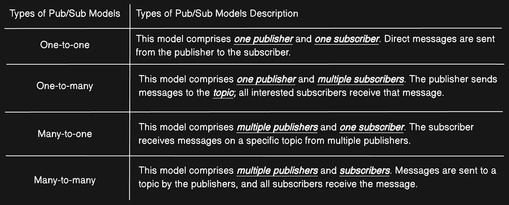

# damn_redis

## Introduction

Redis, which stands for Remote Dictionary Server. It is widely used as a database, cache, and message broker.

### Key Features
 
  - It's an **open-source,** library.
  - It is fast because of it's architecture.
  - Redis is single threaded but it can handle thread concurrently using redis config file or use command `redis-server --io-threads 4` (**concurrently v/s Parallelism in FYI**) .
  - It's uses **in-memory data store (RAM)** but also provide to store **Persistence** storage option to save data when server reloaded.
    - It uses **RDB (Redis Database) snapshots and AOF (Append Only File) log** to save on disk. (Read FYI below, for RDB and AOF).
  - **Redis supports a variety of data structures**, including strings, lists, sets, hashes and sorted set.
  - **Create multiple clusters** and **supports horizontal scaling** for large database. (Why??)
  - **Redis Cluster allows automatic sharding** of data across multiple nodes
  - It also support **Pub/Sub (Publishers/Subscribers)** feature. It allows **Decoupled Communication between multiple Redis clients**
    - **Publishers** send messages to channels without knowing who the subscribers are.
    - **Subscribers** receive messages from channels they are subscribed to, without knowing who the publishers are.
    - **More detail about pub/sub in FYI section** 

## Operations Keys

- EXPIRE key seconds: Sets a timeout on a key.
- TTL key: Gets the remaining time to live (TTL) of a key.


## LUA Script
Lua Script allows you to run custom scripts directly on the Redis server.

- It is executed atomically. This means that while a script is running, no other commands can be executed, ensuring that all operations within the script are completed without interference.
- Running LUA scripts directly on the server reduces the number of round trips between the application and Redis, improving performance for multi-step operations.
- It can call any Redis command using redis.call() or redis.pcall() (**Description in Error handling section**), allowing for flexible data manipulation.

### Use case
1. **Conditional Operations**
   
   ```lua
    EVAL "if redis.call('GET', KEYS[1]) == ARGV[1] then return redis.call('SET', KEYS[1], ARGV[2]) else return 0 end" 1 mykey oldvalue newvalue
   ```
    Above script is simple if else statement with Arguments (1 mykey oldvalue newvalue) 
   
     - '1': This indicates that there is one key being passed to the script.
     - 'mykey': This is the key being checked and potentially updated.
     - 'oldvalue': This is the expected current value of the key.
     - 'newvalue': This is the new value to set if the current value matches oldvalue.

2. **Rate Limiting**
   
   ```lua
    EVAL "local count = redis.call('INCR', KEYS[1]) if count == 1 then redis.call('EXPIRE', KEYS[1], ARGV[1]) end return count" 1 user:123:requests 60
   ```
   - '1': This indicates that there is one key being passed to the script.
   - user:123:requests: This is the key being incremented and potentially set with an expiration time.
   - 60: This is the expiration time (TTL) in seconds to set if the incremented value is 1.
  
3. **Complex Aggregations** 
   ```lua
    EVAL "return redis.call('GET', KEYS[1]) + redis.call('GET', KEYS[2])" 2 key1 key2
   ```
4. **Custom Command Creation**

## Error Handling

> Commonly used in Eval Script

- Use **redis.call()** for normal command execution. Errors will be returned directly to the client.
- Use **redis.pcall()** if you want to handle errors gracefully within the script context without stopping execution.

## Operation Commands

### Must-Know Commands

| **Command**  | **Description**                                                        | **Usage Example**                             |
|--------------|------------------------------------------------------------------------|-----------------------------------------------|
| **SET**      | Sets the value of a key.                                               | `SET mykey "value"`                           |
| **GET**      | Gets the value of a key.                                               | `GET mykey`                                   |
| **DEL**      | Deletes one or more keys.                                              | `DEL mykey`                                   |
| **EXPIRE**   | Sets a timeout (TTL) on a key.                                         | `EXPIRE mykey 60`                             |
| **INCR**     | Increments the value of a key by 1 (used for counters).               | `INCR counter`                                |
| **KEYS**     | Finds all keys matching a pattern.                                     | `KEYS user*`                                  |
| **TTL Key**     | Gets the remaining time-to-live of a key.                                     | `TTL key`                                  |


### Delete Commands

| **Command**  | **Description**                                      | **Usage Example**                             |
|--------------|------------------------------------------------------|-----------------------------------------------|
| **DEL**      | Deletes one or more keys                             | `DEL mykey`                                   |
| **UNLINK**   | Deletes the key(s) in a non-blocking manner          | `UNLINK mykey`                                |
| **FLUSHDB**  | Removes all keys from the current database           | `FLUSHDB`                                     |
| **FLUSHALL** | Removes all keys from all databases                  | `FLUSHALL`                                    |


### **String Commands**

| **Command**   | **Description**                        | **Usage Example**                               |
|---------------|----------------------------------------|-------------------------------------------------|
| SET           | Sets the string value of a key         | `SET mykey "Hello"`                             |
| GET           | Gets the value of a key                | `GET mykey`                                     |
| DEL           | Deletes one or more keys               | `DEL mykey`                                     |
| EXPIRE        | Sets a timeout on a key                | `EXPIRE mykey 60`                               |
| TTL           | Gets the time to live (TTL) of a key   | `TTL mykey`                                     |
| INCR          | Increments the integer value of a key  | `INCR mycounter`                                |
| DECR          | Decrements the integer value of a key  | `DECR mycounter`                                |
| APPEND        | Appends a value to the key             | `APPEND mykey "World"`                          |
| MSET          | Sets multiple keys to multiple values  | `MSET key1 "val1" key2 "val2"`                  |
| MGET          | Gets the values of multiple keys       | `MGET key1 key2`                                |

---

### **Hash Commands**

| **Command**   | **Description**                           | **Usage Example**                               |
|---------------|-------------------------------------------|-------------------------------------------------|
| HSET          | Sets the value of a field in a hash       | `HSET myhash field1 "Hello"`                    |
| HGET          | Gets the value of a field in a hash       | `HGET myhash field1`                            |
| HDEL          | Deletes one or more fields in a hash      | `HDEL myhash field1`                            |
| HMSET         | Sets multiple fields in a hash            | `HMSET myhash field1 "Hello" field2 "World"`    |
| HGETALL       | Gets all fields and values in a hash      | `HGETALL myhash`                                |
| HINCRBY       | Increments the integer value of a field   | `HINCRBY myhash field 5`                        |
| HLEN          | Gets the number of fields in a hash       | `HLEN myhash`                                   |

---

### **List Commands**

| **Command**   | **Description**                                  | **Usage Example**                               |
|---------------|--------------------------------------------------|-------------------------------------------------|
| LPUSH         | Pushes a value onto the head of a list           | `LPUSH mylist "World"`                          |
| RPUSH         | Pushes a value onto the tail of a list           | `RPUSH mylist "Hello"`                          |
| LPOP          | Pops a value from the head of a list             | `LPOP mylist`                                   |
| RPOP          | Pops a value from the tail of a list             | `RPOP mylist`                                   |
| LRANGE        | Gets a range of elements from a list             | `LRANGE mylist 0 -1`                            |
| LLEN          | Gets the length of a list                        | `LLEN mylist`                                   |
| LSET          | Sets the value of an element by index            | `LSET mylist 0 "New Value"`                     |
| LREM          | Removes elements from a list                     | `LREM mylist 2 "value"`                         |

---

### **Set Commands**

| **Command**   | **Description**                              | **Usage Example**                               |
|---------------|----------------------------------------------|-------------------------------------------------|
| SADD          | Adds one or more members to a set            | `SADD myset "Hello"`                            |
| SREM          | Removes one or more members from a set       | `SREM myset "Hello"`                            |
| SMEMBERS      | Gets all members in a set                    | `SMEMBERS myset`                                |
| SISMEMBER     | Checks if a member exists in a set           | `SISMEMBER myset "Hello"`                       |
| SCARD         | Gets the number of members in a set          | `SCARD myset`                                   |
| SUNION        | Gets the union of multiple sets              | `SUNION set1 set2`                              |
| SINTER        | Gets the intersection of multiple sets       | `SINTER set1 set2`                              |

---

### **Sorted Set Commands**

| **Command**   | **Description**                                      | **Usage Example**                               |
|---------------|------------------------------------------------------|-------------------------------------------------|
| ZADD          | Adds a member to a sorted set with a score           | `ZADD myzset 1 "one"`                           |
| ZRANGE        | Gets a range of members in a sorted set              | `ZRANGE myzset 0 -1`                            |
| ZREM          | Removes a member from a sorted set                   | `ZREM myzset "one"`                             |
| ZSCORE        | Gets the score of a member in a sorted set           | `ZSCORE myzset "one"`                           |
| ZINCRBY       | Increments the score of a member in a sorted set     | `ZINCRBY myzset 1 "one"`                        |
| ZCARD         | Gets the number of members in a sorted set           | `ZCARD myzset`                                  |

---

### **HyperLogLog Commands**

| **Command**   | **Description**                                     | **Usage Example**                               |
|---------------|-----------------------------------------------------|-------------------------------------------------|
| PFADD         | Adds elements to a HyperLogLog                      | `PFADD myhll "element1"`                        |
| PFCOUNT       | Gets the approximate cardinality of the HyperLogLog | `PFCOUNT myhll`                                 |
| PFMERGE       | Merges multiple HyperLogLogs into one               | `PFMERGE merged_hll hll1 hll2`                  |

---

### **Bitmaps Commands**

| **Command**   | **Description**                        | **Usage Example**                               |
|---------------|----------------------------------------|-------------------------------------------------|
| SETBIT        | Sets the bit at a specified offset     | `SETBIT mykey 7 1`                              |
| GETBIT        | Gets the bit value at a specified offset | `GETBIT mykey 7`                                |
| BITCOUNT      | Counts the number of set bits          | `BITCOUNT mykey`                                |
| BITOP         | Performs bitwise operations            | `BITOP AND destkey key1 key2`                   |

---

### **Stream Commands**

| **Command**   | **Description**                              | **Usage Example**                               |
|---------------|----------------------------------------------|-------------------------------------------------|
| XADD          | Appends an entry to a stream                 | `XADD mystream * field1 "value1"`               |
| XREAD         | Reads entries from one or more streams       | `XREAD COUNT 2 STREAMS mystream 0`              |
| XLEN          | Gets the length of a stream                  | `XLEN mystream`                                 |
| XRANGE        | Gets entries within a range of IDs           | `XRANGE mystream 0 +`                           |
| XDEL          | Removes one or more entries from a stream    | `XDEL mystream 1526569495637-0`                 |

---

### **Pub/Sub Commands**

| **Command**   | **Description**              | **Usage Example**                                |
|---------------|------------------------------|-------------------------------------------------|
| PUBLISH       | Sends a message to a channel | `PUBLISH mychannel "Hello, subscribers!"`       |
| SUBSCRIBE     | Subscribes to a channel      | `SUBSCRIBE mychannel`                           |
| UNSUBSCRIBE   | Unsubscribes from a channel  | `UNSUBSCRIBE mychannel`                         |

---

### **Transactions Commands**

| **Command**   | **Description**                                      | **Usage Example**                                |
|---------------|------------------------------------------------------|-------------------------------------------------|
| MULTI         | Marks the start of a transaction block               | `MULTI`                                         |
| EXEC          | Executes all commands issued after MULTI             | `SET key1 "val1"`<br>`SET key2 "val2"`<br>`EXEC`|
| DISCARD       | Discards all commands issued after MULTI             | `MULTI`<br>`SET key1 "val1"`<br>`DISCARD`       |

---

### **Scripting (Lua) Commands**

| **Command**   | **Description**                                  | **Usage Example**                               |
|---------------|--------------------------------------------------|-------------------------------------------------|
| EVAL          | Evaluates a Lua script                           | `EVAL "return redis.call('SET', KEYS[1], ARGV[1])" 1 mykey "value"` |
| EVALSHA       | Evaluates a Lua script using SHA1 hash           | `EVALSHA sha1 1 mykey "value"`                  |
| SCRIPT LOAD   | Loads a Lua script into Redis                    | `SCRIPT LOAD "return redis.call('GET', KEYS[1])"` |
| SCRIPT FLUSH  | Removes all cached Lua scripts                   | `SCRIPT FLUSH`                                  |
| SCRIPT KILL   | Kills the currently executing Lua script         | `SCRIPT KILL`                                   |

---

### **Key Management Commands**

| **Command**   | **Description**                          | **Usage Example**                               |
|---------------|------------------------------------------|-------------------------------------------------|
| EXISTS        | Checks if a key exists                   | `EXISTS mykey`                                  |
| EXPIRE        | Sets a timeout on a key                  | `EXPIRE mykey 60`                               |
| PERSIST       | Removes the timeout from a key           |

 `PERSIST mykey`                                 |
| RENAME        | Renames a key                            | `RENAME oldkey newkey`                          |
| KEYS          | Finds all keys matching a pattern        | `KEYS pattern*`                                 |
| TYPE          | Gets the data type of a key              | `TYPE mykey`                                    |
| SCAN          | Iterates through keys                    | `SCAN 0 MATCH pattern* COUNT 100`               |

---

This covers all major Redis commands in categorized markdown tables.

## Competitors
Memcached

Apache Ignite

Hazelcast

Couchbase

## For Your Information (FYI)

### RDB (Redis Database) Snapshots:
- It's a one of the method to store data persistly in redis. This method **creates the binary file** (commonly named dump.rdb) that contains the state of the database at specific intervals.
- It's save the data on **interval bases or the number of changes made**. Example, might set it to save every 60 seconds if at least 1,000 keys have changed.

### AOF (Append Only File):
- It's logs every write operation received by Redis **in a sequential manner** in **plain text file**.
- Each time Redis executes a command that alters data (like SET or DEL), it appends that command to the AOF file.
- **Slower than RDB but safer than RDB**


### Pub/Sub (Publishers/Subscribers)

Pub/Sub (short for publish/subscribe) is a messaging technology that facilitates communication between different components in a distributed system.

It's provides a simple and efficient messaging system between clients. In Redis, clients can “publish” messages to a named channel, and other clients can “subscribe” to that channel to receive the messages.

#### Key Points
- It  is **synchronous**. Subscribers and publishers must be **connected at the same time** in order for the message to be delivered.
- It uses **Fire & Forget messaging pattern** where the sender **sends a message without expecting an explicit acknowledgment** from the receiver that the message was received. The sender simply sends the message and moves on to the next task, regardless of whether or not the message was actually received by the receiver.
- Similarly, **Pub/Sub Redis is fan-out** only, meaning that when a publisher sends a message, it is broadcast to all active subscribers. All subscribers **receive a copy of the message**, **regardless of whether they are specifically interested in the message or not**.
  
#### Communication Model
They are usually classified under **four models** based on the number of publishers and subscribers involved in the communication, which include **one-to-one, one-to-many, many-to-one, and many-to-many**.



#### Under the Hood (Redis) 

> Reference [[Medium Redis Pub/Sub in depth](https://medium.com/@joudwawad/redis-pub-sub-in-depth-d2c6f4334826#7b45)]

#### Use Cases
- Refreshing distributed caches
- Real-time notifications
- Sending messages between microservices
- Communicating between different parts of a single application
- Event-driven architectures Applications
- News updates and alerts

## Integration Example (in node app)

> Find the complete redis.js file inside repo (redis_implementation/node/redis.js)

#### Step 1. Install the Redis in your existing project
   ```bash
   npm install redis
   ```
#### Step 2. Initilization the redis
Now, we have to initialize your redis in our application. We can create the separate file for redis (redis_db.js) or use index.js. Below is the example of How to initialize redis.

```javascript
// middlewares/redis.js
const { createClient } = require("redis");

let redisClient = undefined;
async function initializeRedisClient() {
  let redisURL = process.env.REDIS_URI // localhost:6379 or for production we can redis cloud endpoint
  if (redisURL) {
    redisClient = createClient({ url: redisURL }).on("error", (e) => {
      console.error(`Failed to create the Redis client:`);
      console.error(e);
    });

    try {
      await redisClient.connect();
      console.log(`Connected to Redis successfully!`);
    } catch (e) {
      console.error(`Connection to Redis failed with error:`);
      console.error(e);
    }
  }
}

function isRedisWorking() {
  // verify wheter there is an active connection
  // to a Redis server or not
  return !!redisClient?.isOpen;
}
```
#### Step 3. Define the Redis Key Generation Logic with Hash Key

When the Node.js server receives a request for an exposed endpoint, Express intercepts it and translates it into the req object. Thus, a request is nothing more than a JavaScript object at the application level.

If you follow that approach,Let's say /api/v1/users?offset=10&page=1 and /api/v1/users?page=1&offeset=1 will produce two different keys. However, those are exactly the same API call.

A more effective solution is to rely on object-hash, a popular npm package for generating order-insensitive, consistent, and reliable hashe

```
npm install object-hash
```

```javascript
// middlewares/redis.js
const hash = require("object-hash");

function requestToKey(req) {
  // build a custom object to use as part of the Redis key
  const reqDataToHash = {
    query: req.query,
    body: req.body,
  };

  // keys on a Redis client
  return `${req.path}@${hash.sha1(reqDataToHash)}`;
}
```
#### Step 4. Add Read/ Write operation for redis

Now, we have to add the function to read/write in the redis.But before direct writing, we **Compress it Before Storing It in Redis**. The approach to implementing the caching layer in Node.js presented above is great, but it has one major drawback. JSON is not the most byte-efficient data format. Storing raw data directly in Redis is good for readability, but it comes at the cost of memory usage.

To avoid that, you can compress the raw response produced by the server before writing it to Redis and then decompress it after reading it accordingly. All you have to do is add a compression option to your writeData() and readData() functions and use the Node.js built zlib library as below:

```javascript
// middlewares/redis.js

/**
 * options is an object that involves the following fields:

   {
      EX, // the specified expire time in seconds
      PX, // the specified expire time in milliseconds
      EXAT, // the specified Unix time at which the key will expire, in seconds
      PXAT, // the specified Unix time at which the key will expire, in milliseconds
      NX, // write the data only if the key does not already exist
      XX, // write the data only if the key already exists
      KEEPTTL, // retain the TTL associated with the key
      GET, // return the old string stored at key, or "undefined" if key did not exist
   }
*/
async function writeData(key, data, options, compress) {
   
  if (isRedisWorking()) {
    let dataToCache = data;
    if (compress) {
      // compress the value with ZLIB to save RAM
      dataToCache = zlib.deflateSync(data).toString("base64");
    }

    try {
      await redisClient.set(key, dataToCache, options);
    } catch (e) {
      console.error(`Failed to cache data for key=${key}`, e);
    }
  }
}
```
**Simarlarly Read Redis**
```javascript
async function readData(key, compressed) {
  let cachedValue = undefined;
  if (isRedisWorking()) {
    cachedValue = await redisClient.get(key);
    if (cachedValue) {
      if (compressed) {
        // decompress the cached value with ZLIB
        return zlib.inflateSync(Buffer.from(cachedValue, "base64")).toString();
      } else {
        return cachedValue;
      }
    }
  }

  return cachedValue;
}
```

#### Step 5. Addinng middleware for compressing data for optimization
The approach to implementing the caching layer in Node.js presented above is great, but it has one major drawback. JSON is not the most byte-efficient data format. Storing raw data directly in Redis is good for readability, but it comes at the cost of memory usage.

To avoid that, you can compress the raw response produced by the server before writing it to Redis and then decompress it after reading it accordingly. All you have to do is add a compression option to your writeData() and readData() functions and use the Node.js built zlib library as below:

```javascript
function redisCachingMiddleware(
  options = {
    EX: 21600, // 6h
  },
  compression = true
) {
  return async (req, res, next) => {
    if (isRedisWorking()) {
      const key = requestToKey(req);
      const cachedValue = await readData(key, compression);
      if (cachedValue) {
        try {          
          return res.json(JSON.parse(cachedValue));
        } catch {
          return res.send(cachedValue);
        }
      } else {
        const oldSend = res.send;
        res.send = function (data) {
          res.send = oldSend;

          if (res.statusCode.toString().startsWith("2")) {
            writeData(key, data, options, compression).then();
          }

          return res.send(data);
        };

        next();
      }
    } else {
      next();
    }
  };
}
```
#### Step 6. Register the Middleware to the Routes You Want to Cache

#### Step 7. Add the redis in the index.js
```javascript
app.get("/api/", redisCachingMiddleware(), {text: "Damn Redis"});
```
**Final index.js**
```javascript
// index.js

const express = require("express");
require("dotenv").config();
const {
  initializeRedisClient,
  redisCachingMiddleware,
} = require("./src/middlewares/redis");

async function initializeExpressServer() {
  const app = express();
  app.use(express.json());

  // connect to Redis
  await initializeRedisClient();

  // add middleware
  app.get("/api/", redisCachingMiddleware(), {text: "Damn Redis"});

  const port = 8000;
  app.listen(port, () => {
    console.log(`Server is running on http://localhost:${port}`);
  });
}

initializeExpressServer()
  .then()
  .catch((e) => console.error(e));
```


#### Project Folder Structure
```
├── node_modules/
├── src/
│    ├── middlewares/
│    │    └── redis.js
│    └── index.js
├── .env
├── package-lock.json
├── package.json
└── README.md
```


## Follow up Questions

1. List the main operation keys of Redis in detail.
2. How can the durability of Redis be enhanced?
   > - We should call Fsysnc() with every passing second despite the 1-second data loss when the system gets failed.
   >  - We should call Fsysnc() when a new command gets added to the append log file.
   
3. How can the Redis be used with the any application? Give example in sanic!
4. How can a Redis database be emptied?
5. Mention and describe some commands of Redis
6. Explain REPL and Redis-CLI.
7. What is meant by hashes in Redis?
8. What is meant by data modeling in Redis?
9.  How can a Redis database be moved from one server to another server?
10. How can the array data be obtained from Redis?
11. What is meant by "Redis is Binary Safe"?
12. Which things should be kept in mind while using Redis?
13. What is meant by SUNION, SINTER, SUNIONSTORE and SINTERSTORE?


## Writters
We are grateful to our amazing collaborators who make this blog possible. If you'd like to join our team, contribute regularly, and help us grow, we'd love to have you on board!

 
---

Thank you for being a part of our community. Together, we can create something amazing. Happy coding! 🚀

If you have any questions or need help, feel free to reach out. Let's learn and grow together!

---